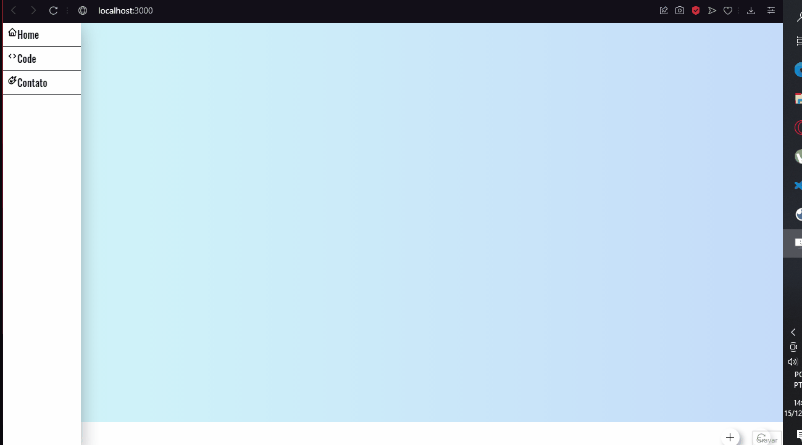
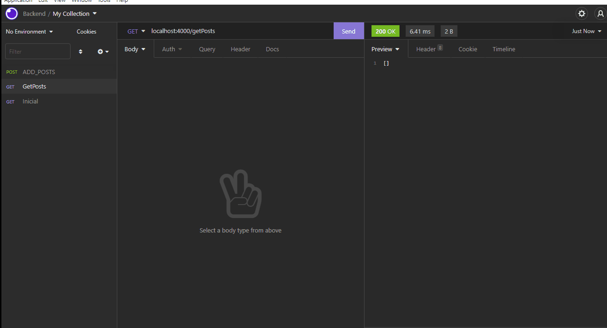

# React-Post-It
<h1 align="center"> Projeto Em Construção </h1>
<h3 align="center"> Front-End </h3>
<h1 align="center"> 
    
</h1>
<h3 align="center">Backend</h3>
<h1 align="center"> 
    
</h1>
<h3>Tecnologias Utilizadas </h3>
 <ul>
  <li>

 ✔️ NodeJS

 ✔️ Nodemon
   
 ✔️ Express

 ✔️ Typescript
   
 ✔️ ReactJS

 ✔️ React Hooks
 
 ✔️ React-Icons

 ✔️ Axios
   
 ✔️ Insonmia REST
 
 </li>
 </ul>
   
